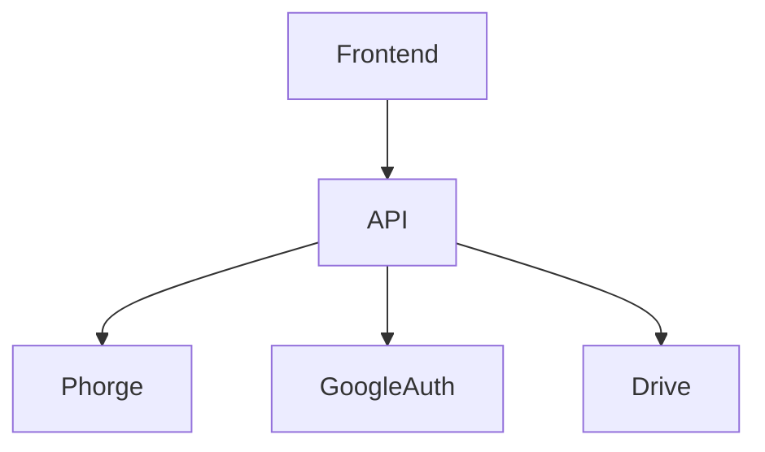
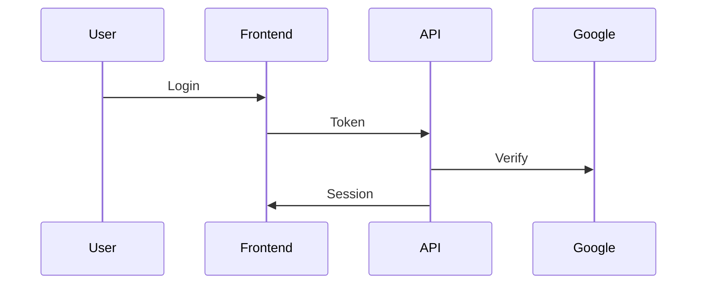

# `/docs/api/index.md`

# API

The API layer connects frontend, Phorge, and external services.
This section documents the APIs used by the project.

## Sections

- Authentication
- Webhooks
- Data exchange
- Error handling

## Core Responsibilities

- Authentication
- Role management
- File linking
- Webhook handling
- Phorge integration

## Architecture

# Endpoints

## Auth
POST /auth/login

## Projects
GET /projects
POST /projects

## Webhooks
POST /webhook

## Token Flow

## Security
- OAuth 2.0
- HTTPS required
- Token validation
- Role-based access

## Example Request
curl -X POST /api/projects \
  -H "Authorization: Bearer TOKEN"

## Preview checkpoint
- API responds
- Auth validated
