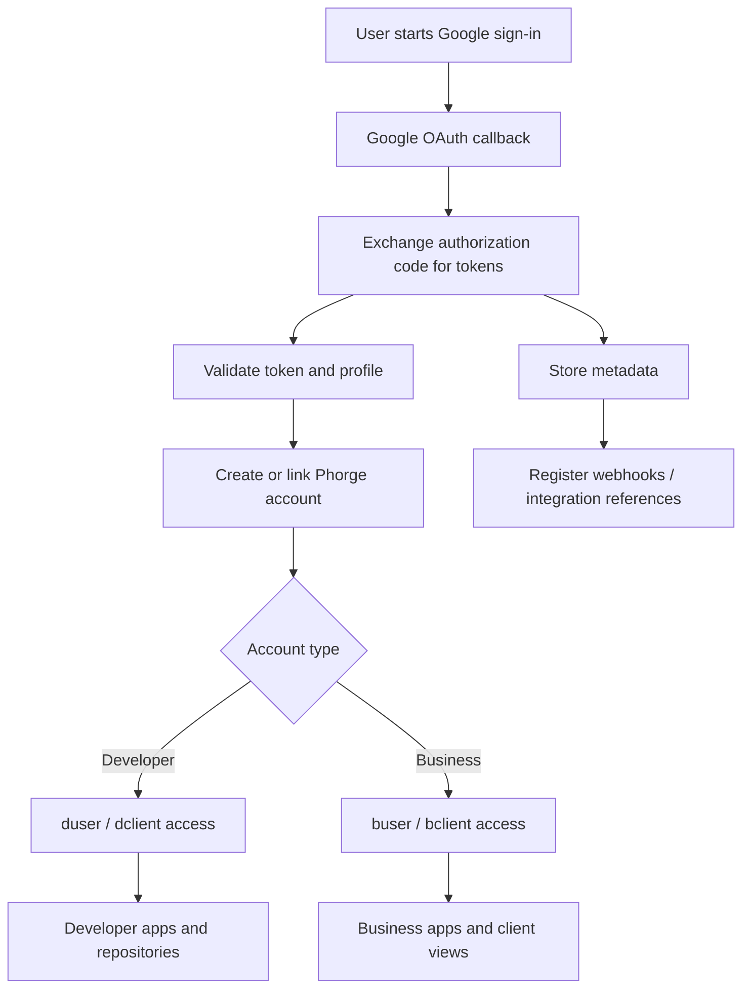

# Authentication Flow

This page documents the authentication flow for the platform.

## Overview

The system uses Google authentication to distinguish business and personal account types.

## Main Steps

1. User selects sign-in with Google.
2. OAuth flow redirects to Google.
3. Google returns identity token and profile metadata.
4. Backend validates the token.
5. Account type is mapped:
   - business user
   - personal user
   - developer user
   - client user
6. Session is created and permissions are applied.
7. Related integrations such as Drive access, webhook registration, and metadata exchange are initialized.

## Notes

- Use role-based access control for dclient, bclient, duser, and buser.
- Preserve external Google Drive references when files are imported.
- Store token exchange and webhook metadata securely.

# Google Auth + Phorge Integration Flow

