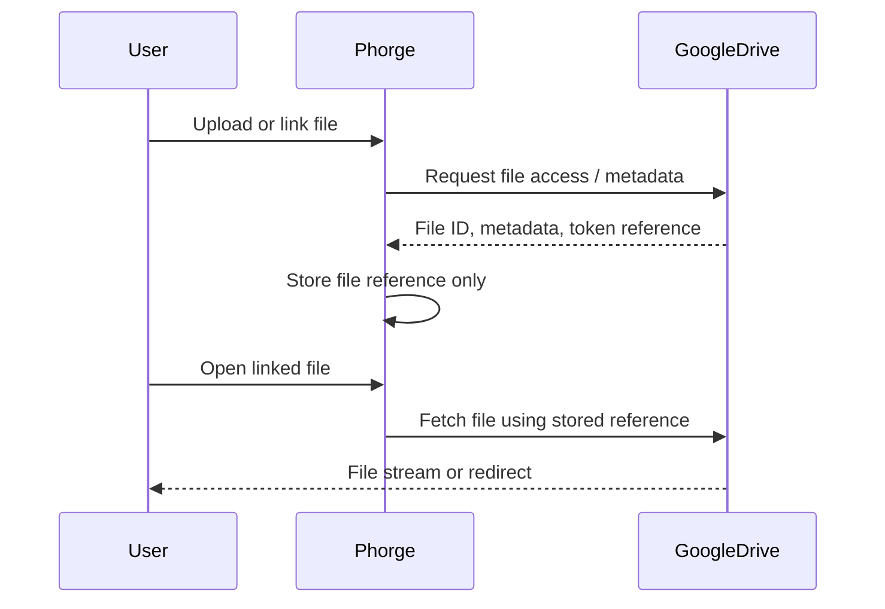

# Google Drive File Integration

```mermaid
sequenceDiagram
  participant User
  participant Phorge
  participant GoogleDrive

  User->>Phorge: Upload or link file
  Phorge->>GoogleDrive: Request file access / metadata
  GoogleDrive-->>Phorge: File ID, metadata, token reference
  Phorge->>Phorge: Store file reference only
  User->>Phorge: Open linked file
  Phorge->>GoogleDrive: Fetch file using stored reference
  GoogleDrive-->>User: File stream or redirect
```
