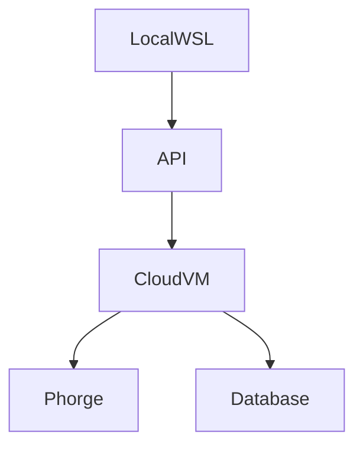

# `/docs/environments/index.md`

# Environments

Defines system environments across local and cloud infrastructure.

## Environment Types

### Local (WSL)

- Ubuntu
- Developer tools
- Local API

### Cloud (GCP VM)

- Apache2
- Phorge backend
- MySQL

## Architecture

# Users
| Environment | User       |
| ----------- | ---------- |
| Local       | user1      |
| Cloud       | clouduser  |
| Phorge      | phorgeuser |

## Configuration
- Environment variables
- API endpoints
- Auth configs

## Deployment Flow

npm run build
git push
CI deploy

## Preview checkpoint
- Local runs
- VM accessible
