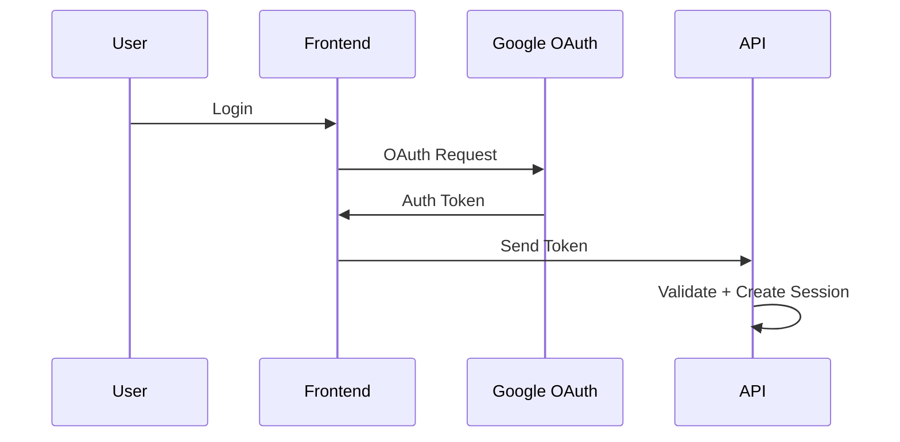

# Google Authentication Integration

## Purpose

Explain how Google authentication connects users to the platform.

## Topics

- OAuth client setup
- redirect URIs
- token handling
- account linking
- role mapping

## Flow 

