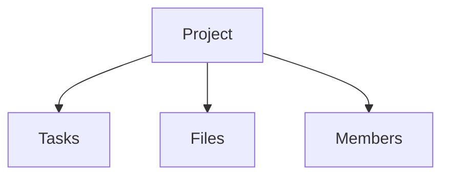

# `/docs/projects/index.md`

# Projects

Projects represent business or development initiatives managed within the platform.

## Project Types

- Development projects
- Business workflows
- Client projects

## Structure

## Lifecycle
Creation
Assignment
Execution
Monitoring
Completion

# Phorge Integration
## Projects are mapped to:

- Workboards
- Tasks
- Repositories

## Metadata

Stored:
- Owner
- Role mapping
- File references
- Activity logs

## Preview checkpoint
- Projects visible
- Tasks linked
