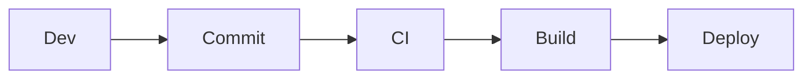

# `/docs/releases/index.md`

# Releases

This section defines versioning and deployment strategy.

## Versioning Strategy

- Semantic versioning:

Example:

- 1.0.0 → Initial release
- 1.1.0 → New integrations
- 1.1.1 → Fixes

## Release Pipeline

## Deployment Targets
- Local (WSL)
- Staging (VM)
- Production (GCP)

## Git Workflow
- main → production
- dev → development
- feature/* → new features

## Release Checklist
 Docs updated
 API validated
 Auth tested
 Webhooks verified
 Build successful

## Preview checkpoint
- Deployment works
- Version updated
