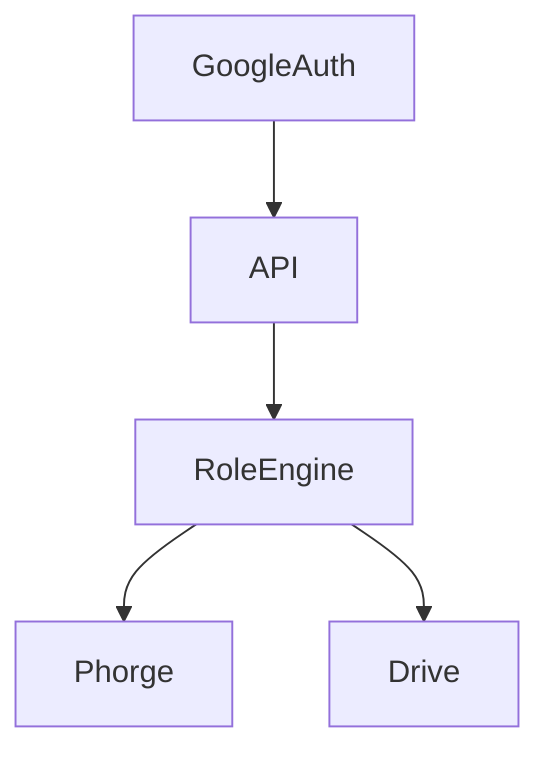

# `/docs/roles/index.md`

# Roles & Access Model

The system supports multiple user roles across development and business environments.

## Role Types

### Core Users

| Role | Description |
|------|------------|
| user1 | Local WSL admin |
| clouduser | VM-level operator |
| phorgeuser | System-level service account |

### Application Roles

| Role | Description |
|------|------------|
| dclient | Developer (Phorge access) |
| bclient | Business user |
| buser | Business client user |
| duser | Developer client user |

## Access Layers

| Resource | dclient    | bclient |
| -------- | ---------- | ------- |
| Projects | ✅          | ✅       |
| Code     | ✅          | ❌       |
| Files    | ✅          | ✅       |
| Admin    | ⚠️ limited | ❌       |

## Identity Handling
- Google account = identity source
- Role assigned at:
  - login
  - organization mapping

## Preview checkpoint
- Roles mapped correctly
- Permissions enforced
